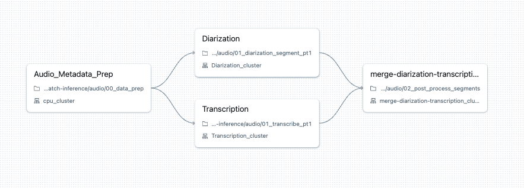
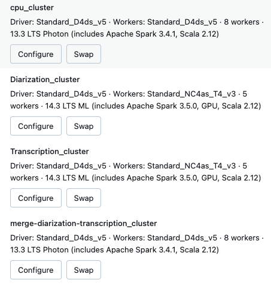

# Speech to text in batch

## How it works

Decouples the following two tasks into separate tasks in workflows:

1. diarization
2. STT (speech to text)


Diarization is performed using onnxruntime-gpu and `pyannote/speaker-diarization-3.0`.
STT is performed using `openai/whisper-large-v3` or `distil-whisper/large-v2`.

We recommend you to use either T4s or A10s. For these workloads. Which ever you can get your hands on. 

If you do not need diarization please feel free to not deploy that and ignore that notebook entirely. 

Transcription and (diarization + reconsilation) are entirely decoupled.

## Features

This was inspired from https://github.com/Vaibhavs10/insanely-fast-whisper and implements:
1. batching
2. optional use of distilled whisper large v2
3. flash attention
4. loading model in fp16
5. Implementation includes diarization in parallel
6. This distributes and decouples diarization and transcription and then merges it together.
7. It does not spend time to do alignment using wav2vec2 alignment
8. Distributed using spark and gpu scheduling

## Performance

When using the following gpus and distil-whisper-large-v2:

1. T4: It takes roughly **2 minutes** to transcribe and it takes roughly **2 minutes** to diarize 1 hour of audio.
2. A10: It takes roughly **1 minute** to transcribe and it takes roughly **1 minute** to diarize 1 hour of audio.
3. A100: It takes roughly **1 minute** to transcribe and it takes roughly **1 minute** to diarize 1 hour of audio.

There is further tuning that can be done such as better batch size. Upon observation you should observe ~10% slowness when 
comparing to the full whisper-large-v3 model. Depending on the fidelity of the audio it may be faster or slower. 

Your mileage may vary please reach out to your databricks contacts for better TCO calculation. This is signifcicantly cheap per hr of audio
in your cloud providers. Spark is used to scale this out.

## Cluster config

Create a cluster policy using the following on azure, aws just switch vm types to equivalent for A10 and A100s:

```json
{
  "node_type_id": {
    "type": "allowlist",
    "values": [
      "Standard_NC24ads_A100_v4",
      "Standard_NC48ads_A100_v4",
      "Standard_NC96ads_A100_v4",
      "Standard_NV36ads_A10_v5"
    ]
  },
  "driver_node_type_id": {
    "type": "fixed",
    "value": "Standard_D4ds_v5"
  },
  "spark_version": {
    "type": "fixed",
    "value": "14.3.x-gpu-ml-scala2.12"
  }
}
```

Then create a multi node gpu cluster with the driver being CPU only.

Run Diarization Segment and Transcription notebooks in parallel and then run the post process segments.

For A10 and A100 gpus it is recommended to be running flash-attn which is configured by default. If you are using T4 comment the line of code out. It will be in the 01_transcribe_pt1 notebook with a comment.

## Workflows





Only transcription and diarization needs T4, A10 or A100 gpus. The rest can be run entirely on CPU as shown above.
